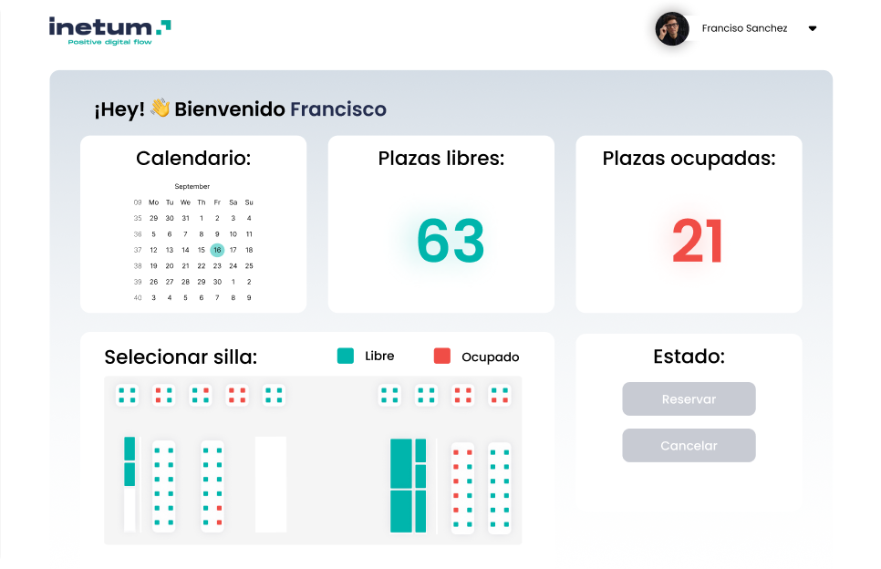

# Office Manager



<a title="LanguagesUsed" target="_blank" href="#">

</a>

***Idioma***
- 🇪🇸 Español
- [🇺🇸 English](https://github.com/emagrina/OfficeManager)

# Índice

- [Resumen](#resumen)
- [Instalación](#instalación)
- [Utilidades básicas del proyecto](#utilidades-básicas-del-proyecto)
    - [Inicio de sesión](#inicio-de-sesión)
    - [Inicio](#inicio)

# Resumen

La aplicación nos permite gestionar los asientos de la oficina, gracias a
ello sabremos la gente que abra ese día en la oficina y donde estarán situados
para no encontrarnos que no hay asientos disponibles.

Tras registrarse con sus credenciales le aparecerá una pantalla muy intuitiva 
donde podremos elegir asiento y día de la reserva, también podremos reservar 
salas de reuniones y mini salas privadas para concentrarse al máximo.

# Instalación

El punto de partida para poder usar esta aplicación es descargarnos localmente el proyecto, para hacerlo debemos usar el siguiente comando:

```bash
git clone https://github.com/emagrina/OfficeManager.git
cd OfficeManager
```

Ahora ya tenemos el proyecto en local, para tenerlo listo para ejecutarlo debemos ejecutar lo siguiente:
```bash
cd OfficeManagerApp
npm install
```
Para levantar el proyecto ejecutamos lo siguiente:
```bash
npm run dev
```

# Utilidades básicas del proyecto

En esta sección vamos a ver algunas características que tiene nuestro proyecto:

## Inicio de sesión
Para acceder con nuestro usuario a la aplicación debemos iniciar sesión 
con nuestras credenciales.


## Inicio
Desde aquí los usuarios podrán gestionar sus asientos, es una interfaz 
bastante intuitiva, nos muestra un calendario donde podremos seleccionar 
el día de la reserva, nos mostrara cuantos asientos quedan libres y cuantos 
están ocupados, y un mapa de la oficina donde seleccionaremos el asiento o 
sala que deseemos.


